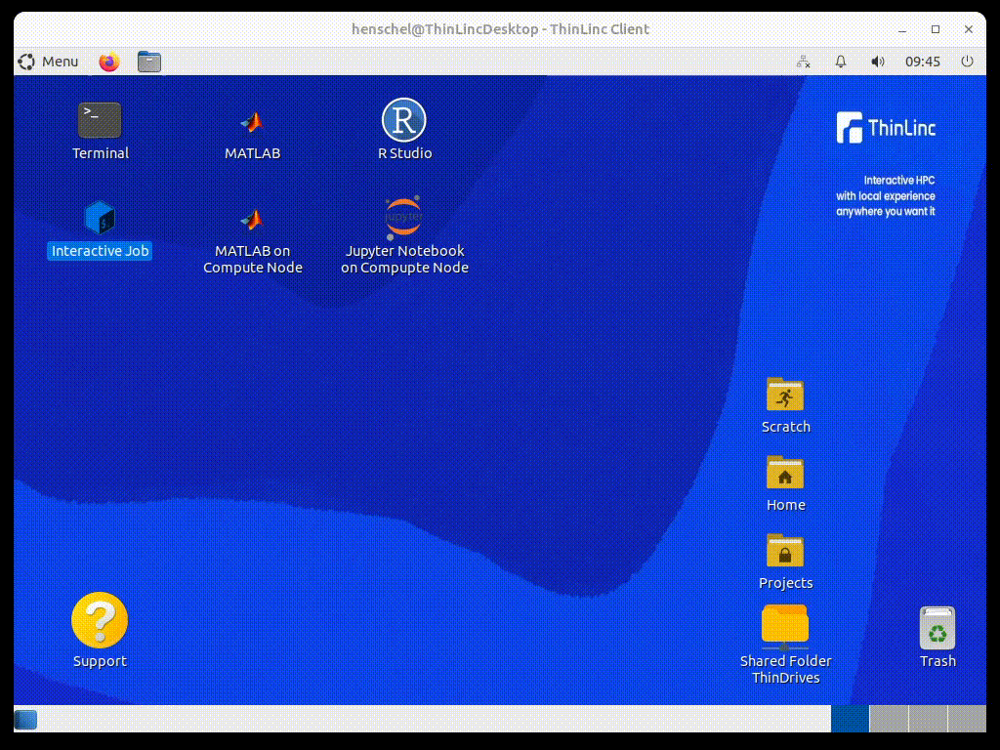

One of the first things that new HPC users have to learn is how to run batch jobs. One way to help users get started is to provide examples script. The easiest way to get started with the batch system is to run interactive jobs, which look very similar to using a terminal on the desktop. This can help users understand what a batch system does and how it launches jobs on compute nodes.

[The script](./interactiveJob.sh) in this repository is provided as an example to illustrate the idea of putting an icon on the desktop that launches an interactive job. Once the job has started, the job command is printed into the terminal, so that users can learn from it and create their own interactive job commands.  
The script requires [Zenity](https://help.gnome.org/users/zenity/stable/), a GNOME utility to display graphical dialogs, and runs the [MATE-Terminal](https://wiki.mate-desktop.org/mate-desktop/applications/mate-terminal/).  
The script should be easy to adapt to your batch system and batch system configuration. The animation below shows what it is like to use the script.

```
#!/bin/bash

CORES=2
HOURS=2
PARTITION=interactive

zenity --info --text="This will launch an interactive job on a compute node with $CORES cores and $HOURS hours of runtime." --no-wrap;

CMD="srun -p $PARTITION --nodes=1 --ntasks-per-node=1 --cpus-per-task=$CORES --time=$HOURS:00:00 --job-name=InteractiveJob --x11 --pty bash"

mate-terminal --title="Interactive Job on Compute Node" -x bash -c "$CMD -c 'echo The following command was used to launch an interactive job:; echo $CMD; echo; bash'"

```



Official BASH icon from https://bashlogo.com/